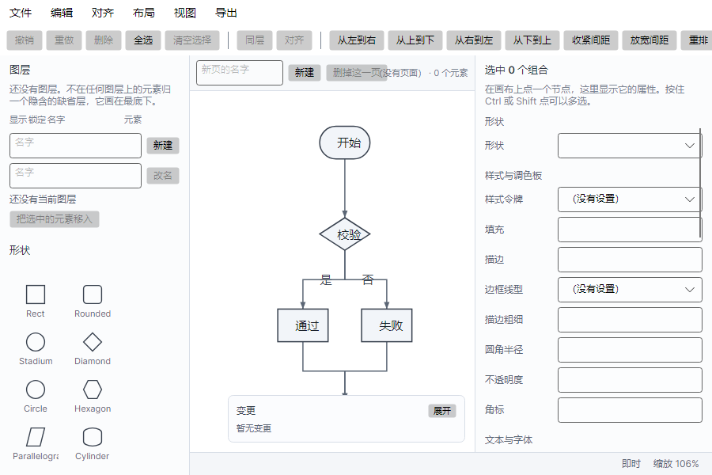
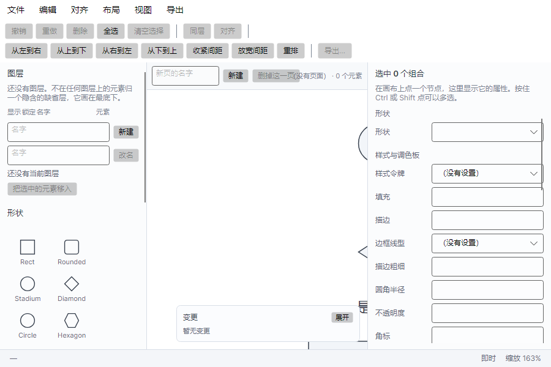

# Phase 5 界面修复——五条显示与操作问题的根因

- 测量时间：2026-09-29
- 测量机器：AMD Ryzen 5 6600H（6 物理核 / 12 逻辑核），16 GB
- 系统：Windows 11 专业版 10.0.26200
- 运行时：.NET 10.0.11，x64 RyuJIT，.NET SDK 10.0.303
- 用途：把界面上报上来的五条问题逐条查到根因，改掉，并各留一条能复跑的判据
- 基线提交：`15d5b0d`（下称「改前」）

## 复现

```bash
dotnet build DuetDiagram.slnx -c Release

# 五条判据分别在三个类别里（全通过则退出码 0）
dotnet test --project DuetDiagram.E2E.Tests/DuetDiagram.E2E.Tests.csproj -c Release -- --filter-trait "Category=Canvas"
dotnet test --project DuetDiagram.E2E.Tests/DuetDiagram.E2E.Tests.csproj -c Release -- --filter-trait "Category=ShapeLibrary"
dotnet test --project DuetDiagram.E2E.Tests/DuetDiagram.E2E.Tests.csproj -c Release -- --filter-trait "Category=Highlight"
```

三条都是绿的：`Category=Canvas` 12/12、`Category=ShapeLibrary` 6/6、`Category=Highlight` 5/5；
整份 `DuetDiagram.E2E.Tests` 240/240。

「改前」那一列读数不是回忆：把 `15d5b0d` 检出到一份独立工作树里重建、重跑同一批用例得到的。
读数来自界面自己的视觉树（`Bounds` 与 `TranslatePoint`）与渲染层的绘制列表，
两者都是屏幕上真正摆出来的东西，不是另算一份。

## 五条问题各是什么

| # | 现象 | 根因 | 判据 |
|---|---|---|---|
| 1 | 左栏有面板挤没了 | 左栏是 `Grid`，四块 Auto 行吃掉全部高度，星号那一行被压成 0，Grid 又不滚动 | `CanvasLayoutTests.No_panel_in_the_left_column_is_squeezed_to_nothing` |
| 2 | 工具栏右边两个按钮跑到窗口外 | `Body` 是 `StackPanel`，横向排不下时不折行，子项被摆到父容器边界之外 | `CanvasLayoutTests.The_toolbar_wraps_instead_of_pushing_buttons_out_of_view` |
| 3 | 人建不出节点 | 形状面板只有「改选中节点的形状」这一条路，没选中时被拒；人能拿到图的另外两条路（导入 Mermaid、打开 `.dsl`）都要求先有文本 | `ShapeLibraryTests.Clicking_a_shape_without_a_selection_creates_a_node`、`...Dropping_a_shape_on_the_canvas_creates_a_node_at_the_drop_point` |
| 4 | 改完节点出现虚线框与右上角圆点，且与选中框分不出来 | 变更标记没有寿命，挂上就一直挂着；选中框与变更轮廓用同一个蓝、又都是虚线 | `HighlightTests.A_mark_expires_after_its_lifetime`、`An_undo_mark_has_no_pulse_but_still_expires` |
| 5 | 节点文字不居中，偏右 | 度量器用主家族那一个字体量整行，绘制方逐字回退，两边对同一段字量出不同的宽度 | `LabelMetricsTests.A_label_is_centred_in_its_node_at_the_width_it_is_drawn` |

五条里有四条是**布局与呈现**，一条是**入口缺失**。四条布局问题的共同点：功能用例一条都不会红
（面板还在视觉树里、按钮还在注册表里、标记确实挂上了、字确实画出来了），
只有量屏幕上真正占了多少地方才看得见。

## 改前改后的截图

两张都是同一份示例文档、同一个窗口尺寸（900×600）、同一份无头宿主抓的帧：

| 改前 | 改后 |
|---|---|
|  |  |

改前那张里能直接看到两条：工具栏最右边的「重排」被切在窗口边上、「导出…」整个看不见；
左栏到「形状」为止，下面的模板、调色板、文本预设一个都看不见。
改后那张是同一个 900×600：工具栏折成两行、15 个条目一个不少，左栏出现了滚动条。

## 一、左栏有面板被压成零高度

**改前的读数**（`Bounds` 是控件自己的尺寸，`inWindow` 是它左上角在窗口里的位置）：

| 面板 | 改前尺寸 | 改前在窗口里的位置 | 改后尺寸 |
|---|---|---|---|
| `LayersView` | 240×228 | (0, 70) | 240×228 |
| `ShapesView` | 240×305 | (0, 298) | 240×305 |
| `TemplatesView` | 240×122 | (0, 603) | 240×122 |
| `PaletteView` | **240×0** | (0, 725) | 240×**141** |
| `TextPresetsView` | 240×169 | (0, **725**) | 240×169 |

两处硬证据：**调色板高度是 0**；而调色板与文本预设的纵向位置**都是 725**——
两块叠在同一个位置上。整列的总高 824 与窗口高度无关，把窗口从 900×600 放大到 1400×900，
这五个数一个都没变。

**根因。** 左栏是 `Grid RowDefinitions="Auto,Auto,Auto,*,Auto"`。四块 `Auto` 行的高度由内容定，
加起来已经超过可用高度，星号那一行（调色板）就被压到 0；而 `Grid` 自己不滚动，
最后一块于是落到窗口外面。放大窗口没用——`Auto` 行的高度不跟着窗口变。

**改法。** 左栏换成 `ScrollViewer`（固定宽 240，纵向滚动、横向不滚）+ `StackPanel`。
五块各自量到的自然高度全都保留，装在一个 469 px 高的滚动视口里（y 从 102 到 571），
装不下的部分靠滚动到达。

**判据怎么卡的。** `CanvasLayoutTests.No_panel_in_the_left_column_is_squeezed_to_nothing`
量的是 `Bounds.Height`，不是「控件在不在视觉树里」——被压成零高度的面板还在视觉树里、
也还能被 Tab 到，看起来却像「这个功能没做」。它量两档：默认尺寸，以及把窗口压到
`MinWidth`/`MinHeight`（900×600）之后。撑满一屏时看不出问题，挤一挤才看得出。

## 二、工具栏按钮跑到窗口外

**改前的读数**（900 宽）：`ToolBarView` 高 **38**（一行），`Body` 是 884×26，
15 个条目从 x=8 依次排开，最后一个（56 宽）的右边缘落在 **x=983**，而窗口只有 900 宽。
倒数第二个（46 宽，起点 860）的右边缘是 906，也出去了。
也就是说**最后两个按钮整个在可视区之外**：点不到，也没有任何迹象说明它们在。

**根因。** `Body` 是 `StackPanel`。横向排不下时它既不折行也不报错，直接把后面的子项
摆到父容器边界之外——父容器不裁剪，于是它们画在窗口外面，或者被窗口边裁掉一半。

**改法。** `Body` 换成 `WrapPanel`。同一个 900 宽：`ToolBarView` 高 **70**（两行），
第一行 7 个（y=38）、第二行 8 个（y=70），最右一个的右边缘是 **575**，全在窗口里。
1280 宽时仍是一行（`Body` 1264 宽，内容到 983），常见情况下不会折。

另外把默认窗口从 900×600 改成 **1280×820**（`MinWidth`/`MinHeight` 保持 900×600）：
原来那个默认尺寸下工具栏本来就排不下，一打开程序就有两个按钮看不见。

**判据怎么卡的。** `CanvasLayoutTests.The_toolbar_wraps_instead_of_pushing_buttons_out_of_view`
先把 `MinWidth` 放开、把窗口压到 640 宽，然后两条：工具栏的高度必须**变大**（说明真的折了行），
以及**逐个**按钮量左右边缘，任何一边越出工具栏范围就红。按钮是从注册表生成的，
所以以后新增一条工具条目，这条也会跟着管住它。

## 三、人建不出节点

**改前。** 形状面板点一下走的是「把选中节点的形状换成这个」；没选中时被拒——
原来那条用例的名字就叫 `Clicking_a_shape_without_a_selection_is_refused`。
人能拿到一张图的另外两条路是导入 Mermaid 与打开一份 `.dsl`，两条都要求先有一份文本。
于是「新建的元素归到当前页」这条约定在界面上没有落点，只在模型层与工具层存在。

**改后，两条入口。**

- **点一下形状**（没选中任何东西时）：在**视口中心**新建一个该形状的节点。
  标识自动取第一个没被占用的 `n1`、`n2`…，节点归当前页，落下即选中。
- **从形状面板按住拖到画布上**：在**落点**新建。落点经 `ViewportTransform.ToDocument`
  换算成文档坐标——不换算的话，缩放或平移过之后新节点会落在离光标很远的地方，
  而那个偏移量随缩放变，看上去毫无规律。
- 拖拽载荷是一个自定义数据格式（`duetdiagram.shape`）。画布只收这一种，
  别的东西（文件、从别处复制的一段文字）拖过来时**显式答「不收」**，
  光标显示禁止，而不是显示可放置之后什么也不发生。
- 节点位置记在 sidecar 的 `_pinned` 里（IR 本身不存坐标）。落点按「新节点的**中心**」解释，
  所以先量一遍这个节点多大，再折成左上角。

**判据怎么卡的。** 两条用例各走一条路。拖拽那条有个坑：无头宿主里 `Drop` 用的是
上一次 `DragEnter`/`DragOver` 记下的目标，**只发 `Drop` 是一条空操作**——
所以用例先发 `DragEnter` 再发 `Drop`，否则它验的是「什么都没发生」而看起来像通过。

## 四、变更标记不消失，且与选中框分不出来

**改前。** 变更高亮有四种手段，其中**轮廓**（元素外一圈虚线）与**角标**（右上角小圆点）
没有寿命：一旦挂上就永远挂着。而选中框用的是同一个蓝（`#1f6feb`）**且同样是虚线**
（`DashStyle([4, 3], 0)`）。改一个正好被选中的元素，屏幕上就是两个几乎重合的虚线框
加一个点——分不出哪个是「我选中的」、哪个是「它被改过」。改得越多，画布越花，
而那时用户已经看不出「哪些是刚改的」了，那正是标记要回答的问题。

**改后。**

- **选中框改成实线。** 于是「实线＝我选中的」「虚线＝它被改过」各靠形状就能认出来，
  颜色只是辅助线索。两种框用的还是同一个蓝，这一点没变——变的是形状。
- **所有变更标记 8 秒后过期**（`Theme.HighlightMarkSeconds`）。脉冲另有自己的档
  （1.5 秒 × 3 次），8 秒取在脉冲总时长之上，免得标记在脉冲还没跑完时就消失。
  过期由 `HighlightTracker` 在每次取快照时剪掉：整条过期的直接删，
  只过脉冲那一档的把脉冲那一种手段剥掉、轮廓与角标留着。`HasHighlights` 随之转假。
- **画布的重画驱动分两档。** 只有脉冲在跑时按 33 ms 出帧（脉冲是动画，要按帧重画）；
  只剩「会过期但不闪」的标记时降到 500 ms 轮询一次（过期不是动画，过期的粒度不必细到帧）；
  全没了就把表停掉——空闲时也转的话，省电模式下会被系统降频，而那个降频会被误读成性能退化。

**判据怎么卡的。** 两条用例都注入一个可控时钟：`A_mark_expires_after_its_lifetime`
验普通变更整条过期；`An_undo_mark_has_no_pulse_but_still_expires` 验撤销来的标记
（继承原来源、带 ↶ 符号）没有脉冲但仍然会过期。把 `Expired` 强行改成 `false`，
两条都会红——这一条验过。

## 五、节点文字不居中（偏右）

**改前的读数。** 示例文档里节点 `start` 的框是 `(80, 19.45, 60×38.9)`，中心 x = **110**，
字号 14：

| 谁量的 | `"开始"` 的宽度 | `"是"` 的宽度 |
|---|---|---|
| Skia 度量器（渲染层） | **18.074** | 9.037 |
| 界面框架画的（`FormattedText`） | **28** | 14 |

绘制列表里文字框是 `(100.963, …, 18.074 宽)`。**框本身是居中的**（100.963 + 9.037 = 110），
但按 28 px 画出来的字实际占 100.963 ~ 128.963，中心落在 **114.96**——
比节点中心**偏右 4.96 px**，两侧余量 20.96 / 11.04 不对称（框本身的两侧余量是 20.96 / 20.96）。
偏多少与字号成正比，字号越大偏得越多。

**根因。** 主题里点名的家族是 `Inter`，这台机器上没装（字体管理器把它解成 `Segoe UI`）。
两边各自回退，而回退的粒度不同：

- 度量器拿主家族对应的**那一个** Skia 字体量**整行**。`Segoe UI` 里没有汉字字形，
  汉字按 `.notdef` 那个字形的宽度（9.037）算，于是「开始」量出 18.07。
- 绘制方是**逐字**回退：汉字交给本机的中文字体，全角字一个占 14 px，「开始」画出来是 28。

同一段字，两边量出 18.07 与 28。**居中是按量出来的宽度算的**，度量偏了，
字就跟着偏，还会溢出框。

**改法。** 度量器改成与绘制方同一条规则：先把这一行按「哪个家族来画」切成若干段
（`FontFallback.FamilyFor` 先问主字体有没有这个字形，没有才去问字体管理器），
逐段用那一段的字体量，再相加。`"开始"` 量出 **28 px**，与绘制方一致；
文字框变成 `(96, …, 28 宽)`，中心 110，两侧余量各 16 px。

两边的回退规则现在收在同一个地方（`FontFallback`），度量器与导出用的绘制器都调它——
各写一份的话，两处迟早会分叉，而分叉的表现正是这条问题。

**判据怎么卡的。** `LabelMetricsTests.A_label_is_centred_in_its_node_at_the_width_it_is_drawn`
不取写死的像素数，而是**用界面框架现量一遍**同一段字，再断言「画出来的中心落在节点框中心上」
（容差 0.5 px）。不写死像素数是因为字的实际宽度随机器上装的字体变，写死的话换一台机器就红，
而红的原因与要验的东西无关。

**这条只能在有界面这一层验**：渲染层里只有 Skia 那一侧，问不出界面框架的回退答案；
快照也验不出来——快照里的位置是按度量摆的，度量偏了它跟着偏，两边自洽。
用例还额外要求「至少有一个全角标签参与」，否则它验的是一段两边都不会偏的字。

**改前改后的度量读数**（同一台机器，同一段代码路径）：

| 样本 | 改前 Skia | 改前界面框架 | 改后 Skia | 改后界面框架 |
|---|---|---|---|---|
| `开始` / `校验` / `通过` / `失败` / `结束` | 18.074 | 28 | **28** | 28 |
| `是` / `否` | 9.037 | 14 | **14** | 14 |
| `日本語` / `한국어` | 27.111 | 42 | **42** | 42 |
| `开始 start` | 49.328 | 59.254 | **59.254** | 59.254 |

**还剩一小块。** 纯西文串两边仍差一点点：`"Start"` 度量 28.916 / 绘制 28.465（约 0.45 px），
`"Start 开始"` 60.751 / 60.300。这是 Skia 与界面框架各自选到的**西文字面**不同，
与「全角字画不出来」那条路不是同一件事，这一轮没有消除。它比原来那 4.96 px 小一个数量级，
且不随全角字参与而放大；记在这里，不写成「已解决」。

## 顺带查出的一件事：那条 500 节点的时间判据为什么会飘

改这一轮时全量端到端跑了一遍，`Importing_a_500_node_diagram_...` 这条时间判据红了。
查下去发现**它量的不是渲染慢**：新增的 8 秒标记寿命配上一枚 33 ms 的定时器，
让无头抓帧的循环一直有活干（抓一帧的实现是「把队列里的作业跑到空为止」），
于是「抓一帧」的耗时被拉到整个标记寿命那么长。这正是上面第四节「重画驱动分两档」的由来——
分成两档之后同一份代码量到的首帧回到 1.5 ~ 1.8 s。

判据本身也一并改了名与门槛，逐条记在 `reports/phase4.md` 的补记里。

## 遗留与没验的

1. **五条都只有自建用例，没有人看着跑过。** 四条布局问题我是靠无头抓帧与视觉树读数判的
   （尺寸、位置、按钮边缘、度量与绘制两个宽度），人眼在真机上看着对不对要真人走一遍——
   尤其「实线选中框 vs 虚线变更框」这一对，在真机的小屏幕上还挤不挤、对比够不够，装置判不了。
   这与 P1-14 / P2-13 / P3-16 / P4-22 / P5-07 同一类：**装置齐了不等于测过了**。
2. **拖拽只验了「落在落点上」。** 吸附、落点预览、拖到面板外取消、拖到已有节点上是什么行为，
   一个都没有；目前拖到已有节点上就是叠上去。
3. **新节点的标识不能自己起。** 自动取 `n1`、`n2`…（跳过已被占用的），改名走属性面板的标签字段。
   标识与标签是两件事，界面上没有改标识的入口。
4. **8 秒是拍的值。** 没有用户测过「多久算够久」；脉冲那一档 1.5 秒 × 3 次也是拍的值。
5. **左栏的滚动条没有真的拖过。** 验的是尺寸与「滚动容器在、五块都有高度」，
   鼠标拖滚动条、滚轮滚左栏这些手势一条都没验。
6. **`MinWidth`/`MinHeight`（900×600）是拍的。** 900 宽时工具栏已经要折两行了，
   这个下限是「再窄就不像话了」定的，不是量出来的。
